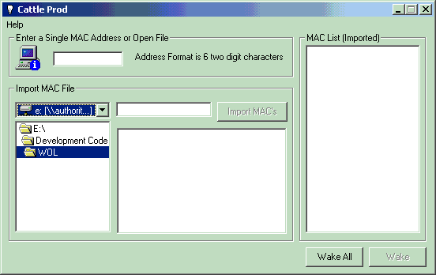



## Wake On\-Lan

### Description

This code and utility provides Wake On-Lan functionality. This code has been devleoped with the help of many people in particular Dave Robinson, Thanks Man!

Well this code is my way of saying thanks to Planet Source Code and to all of the coders out there that share the wealth. This code really does work. Just remember:

1. You need a Wake On-Lan compliant Bios (and it must be enabled in BIOS)

2. You need a Wake On-Lan compliant network adapter

3. Wake On-Lan is a UDP broadcast. You cannot wake workstations on other IP subnets! This is a limitation of the technology not the application.

I Have tested this utility on many types of hardware and it works. If you have a problem feel free to email me.

smanner2@csc.com.au

Thanks!

Simon Manners

Computer Sciences Corporation

Perth, Western Australia
 
### More Info
 

             |
---                |---
**Submitted On**   |2000-08-09 08:10:56
**By**             |[Simon Manners](https://github.com/Planet-Source-Code/PSCIndex/blob/master/ByAuthor/simon-manners.md)
**Level**          |Advanced
**User Rating**    |4.7 (52 globes from 11 users)
**Compatibility**  |VB 6\.0
**Category**       |[Complete Applications](https://github.com/Planet-Source-Code/PSCIndex/blob/master/ByCategory/complete-applications__1-27.md)
**World**          |[Visual Basic](https://github.com/Planet-Source-Code/PSCIndex/blob/master/ByWorld/visual-basic.md)
**Archive File**   |[CODE\_UPLOAD8765882000\.zip](https://github.com/Planet-Source-Code/simon-manners-wake-on-lan__1-10534/archive/master.zip)

